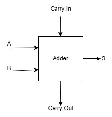

# N-Size ALU

This project defines a variable-sized ALU with a board implementation designed for the [Nandland Go Board](https://nandland.com/the-go-board/).

I was inspired to undertake this project while attending an introductory computer architecture class taught by Professor Rodrigo Izidoro Tinini. I based myself heavily on the material provided in class to design the actual ALU, material which was itself based on the work from another professor, Emilio Francesquini, and on the book [Computer Organization And Design: The Hardware/Software Interface, 5th Edition](https://booksite.elsevier.com/9780124077263/).

The other source that made this project possible is the wonderful work of Russell Merrick from nandland.com. Everything FPGA-related that I applied in this project, I learned from his book, website articles, and YouTube videos.

## ALU Design

### Adder

The 1-bit adder circuit was implemented by changing the result (S) and Carry Out (C_out) operations based on the state of the Carry In.

**Carry_In == 1:**

S = XNOR, C_out = OR

| A | B | S | C_out |
|---|---|---|-------|
| 0 | 0 | 1 | 0 |
| 0 | 1 | 0 | 1 |
| 1 | 0 | 0 | 1 |
| 1 | 1 | 1 | 1 |

**Carry_In == 0:**

S = XOR, C_out = AND

| A | B | S | C_out |
|---|---|---|-------|
| 0 | 0 | 0 | 0 |
| 0 | 1 | 1 | 0 |
| 1 | 0 | 1 | 0 |
| 1 | 1 | 0 | 1 |

### ALU_1_Bit

### N_Size_ALU.vhd

I don't have time to create more images, so this section will be all text.
The final ALU simply stitches together 1-Bit ALUs in a particular order:

* The Carry Out of one stage connects to the Carry In of the next.
* The last adder output (Set) goes into the first Less input.
* All the B Inverts and the first Carry In are shorted into B Negate.
* All A Inverts are shorted.
* All Operations are shorted.
* A NOR gate that takes all results as input is added and named "Zero".

## Go Board Implementation

The board implementation builds a 4-bit ALU and uses four LEDs, two 7-segment displays, and four buttons to control the ALU.
There are six available operations on the board:

* AND: A and B
* OR: A or B
* NAND: A nand B
* NOR: A nor B
* ADD: A + B
* SUB: A - B
* SLT: A < B

